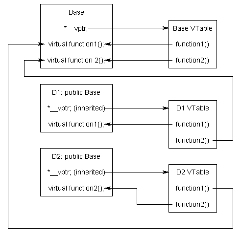

# Chapter 25 - Virtual Functions

Pin: No
Fav: No
Created: April 13, 2026 8:45 PM
Last edited: June 24, 2026 3:23 PM

## Notes

- **Pointers and references to the base class of derived objects**
    
    ```cpp
        // These are both legal!
        Base& rBase{ derived }; // rBase is an lvalue reference (not an rvalue reference)
        Base* pBase{ &derived };
    ```
    
    - Since Derived has a Base part
    - Calling `rBase.getName()` calls `Base::getName()`, not `Derived::getName()`, even though the underlying object is a `Derived`.
        - The reason is that `Derived::getName()` *shadows* (hides) `Base::getName()` only for `Derived`-typed access.
        - This resolution happens based on the *type of the pointer/reference*, not the actual object type.
        - This is called static (compile-time) dispatch.
- **Virtual functions**
    - A **virtual function** is a special type of member function that, when called, resolves to the most-derived version of the function for the actual type of the object being referenced or pointed to.
        - A derived function is considered a match if it has the same signature (name, parameter types, and whether it is const) and return type as the base version of the function. Such functions are called **overrides**.
    
    ```cpp
    class Base
    {
    public:
        virtual std::string_view getName() const { return "Base"; } // note addition of virtual keyword
    };
    
    class Derived: public Base
    {
    public:
        virtual std::string_view getName() const { return "Derived"; }
    };
    ```
    
    - Virtual function resolution only works when a member function is called through a pointer or reference to a class type object.
    - Under normal circumstances, the return type of a virtual function and its override must match.
    - If a function is virtual, all matching overrides in derived classes are implicitly virtual.
    - Never call virtual functions from constructors or destructors.
    - resolving a virtual function call takes longer than resolving a regular one.
        - To make virtual functions work, the compiler has to allocate an extra pointer for each object of a class that has virtual functions. This adds a lot of overhead to objects that otherwise have a small size.
    - **Virtual destructors, virtual assignment, and overriding virtualization**
        - **Virtual destructors**
            - Whenever you are dealing with inheritance, you should make any explicit destructors virtual.
        - **Virtual assignment**
            - virtualizing the assignment operator really opens up a bag full of worms and gets into some advanced topics outside of the scope of this tutorial.
            - Consequently, we are going to recommend you leave your assignments non-virtual for now, in the interest of simplicity.
        - **Ignoring virtualization**
            - Very rarely you may want to ignore the virtualization of a function.
            - use the scope resolution operator to call the base from a derived pointer
        - If a class isn’t explicitly designed to be a base class, then it’s generally better to have no virtual members and no virtual destructor
        - If a class is designed to be used as a base class and/or has any virtual functions, then it should always have a virtual destructor.
        - Herb Sutter: “A base class destructor should be either public and virtual, or protected and non-virtual.”
            - A base class with a protected destructor can’t be deleted using a base class pointer, which prevents deleting a derived class object through a base class pointer.
            - this also prevents *any* use of the base class destructor by the public
            - In other words, using this method, to make the derived class safe, we have to make the base class practically unusable by itself.
- **Polymorphism**
    - the ability of an entity to have multiple forms (the term “polymorphism” literally means “many forms”).
    - **Compile-time polymorphism** refers to forms of polymorphism that are resolved by the compiler. These include function overload resolution, as well as template resolution.
    - **Runtime polymorphism** refers to forms of polymorphism that are resolved at runtime. This includes virtual function resolution.
- **The override and final specifiers, and covariant return types**
    - Use the override specifier (but not the virtual keyword) on override functions in derived classes. This includes virtual destructors.
        - Force override despite type mismatch
        - If a member function is both `const` and an `override`, the `const` must be listed first. `const override` is correct, `override const` is not.
    - **The final specifier**
        - There may be cases where you don’t want someone to be able to override a virtual function, or inherit from a class. The final specifier can be used to tell the compiler to enforce this.
        - If you do not intend your class to be inherited from, mark your class as final.
            - This will prevent other classes from inheriting from it in the first place, without imposing any other use restrictions on the class itself.
    - **Covariant return types**
        - If the return type of a virtual function is a pointer or a reference to some class, override functions can return a pointer or a reference to a derived class. These are called **covariant return types**.
- **Early binding and late binding**
    - **Binding and dispatching**
        - In general programming, **binding** is the process of associating names with such properties.
        - **Function binding** (or **method binding**) is the process that determines what function definition is associated with a function call.
        - The process of actually invoking a bound function is called **dispatching**.
    - **Early binding**
        - In C++, when a direct call is made to a non-member function or a non-virtual member function, the compiler can determine which function definition should be matched to the call. This is sometimes called **early binding** (or **static binding**), as it can be performed at compile-time.
        - The compiler (or linker) can then generate machine language instructions that tells the CPU to jump directly to the address of the function.
        - With early binding, the CPU can jump directly to the function’s address.
    - **Late binding**
        - In some cases, a function call can’t be resolved until runtime. In C++, this is sometimes known as **late binding** (or in the case of virtual function resolution, **dynamic dispatch**).
        - In C++, one way to get late binding is to use function pointers.
        - Late binding is slightly less efficient since it involves an extra level of indirection.
            - With late binding, the program has to read the address held in the pointer and then jump to that address.
- **The virtual table**
    - a lookup table of functions used to resolve function calls in a dynamic/late binding manner.
    - In C++, virtual function resolution is sometimes called **dynamic dispatch**.
        - Early binding/static dispatch = direct function call overload resolution
        - Late binding = indirect function call resolution
        - Dynamic dispatch = virtual function override resolution
    - Every class that uses virtual functions (or is derived from a class that uses virtual functions) has a corresponding virtual table.
        - This table is simply a static array that the compiler sets up at compile time.
        - the compiler also adds a hidden pointer that is a member of the base class, which we will call `*__vptr`
        - `*__vptr` is set (automatically) when a class object is created so that it points to the virtual table for that class.
            - it makes each class object allocated bigger by the size of one pointer.
        
        
        
        - The `*__vptr` in each class points to the virtual table for that class. The entries in the virtual table point to the most-derived version of the function that objects of that class are allowed to call.
- **Pure virtual functions, abstract base classes, and interface classes**
    - **Pure virtual functions**
        - **pure virtual function** (or **abstract function**) that has no body at all
            - `virtual int getValue() const = 0; // a pure virtual function`
        - any class with one or more pure virtual functions becomes an **abstract base class**, which means that it can not be instantiated!
        - **Pure virtual functions with definitions**
            - This paradigm can be useful when you want your base class to provide a default implementation for a function, but still force any derived classes to provide their own implementation.
            - if the derived class is happy with the default implementation provided by the base class, it can simply call the base class implementation directly.
                
                ```cpp
                class Animal // This Animal is an abstract base class
                {
                protected:
                    std::string m_name {};
                
                public:
                    Animal(std::string_view name)
                        : m_name(name)
                    {
                    }
                
                    const std::string& getName() const { return m_name; }
                    virtual std::string_view speak() const = 0; // note that speak is a pure virtual function
                
                    virtual ~Animal() = default;
                };
                
                std::string_view Animal::speak() const
                {
                    return "buzz"; // some default implementation
                }
                
                class Dragonfly: public Animal
                {
                
                public:
                    Dragonfly(std::string_view name)
                        : Animal{name}
                    {
                    }
                
                    std::string_view speak() const override// this class is no longer abstract because we defined this function
                    {
                        return Animal::speak(); // use Animal's default implementation
                    }
                };
                ```
                
    - **Interface classes**
        - An **interface class** is a class that has no member variables, and where *all* of the functions are pure virtual
        - define the functionality that derived classes must implement, but leave the details of how the derived class implements that functionality entirely up to the derived class.
            - Interface classes are often named beginning with an I
            
            ```cpp
            class IErrorLog
            {
            public:
                virtual bool openLog(std::string_view filename) = 0;
                virtual bool closeLog() = 0;
            
                virtual bool writeError(std::string_view errorMessage) = 0;
            
                virtual ~IErrorLog() {} // make a virtual destructor in case we delete an IErrorLog pointer, so the proper derived destructor is called
            };
            ```
            
        - The virtual table entry for a class with a pure virtual function will generally either contain a null pointer, or point to a generic function that prints an error (sometimes this function is named __purecall).
- **Virtual base classes**
    - To share a base class, simply insert the “virtual” keyword in the inheritance list of the derived class
    - there is only one base object. The base object is shared between all objects in the inheritance tree and it is only constructed once.
        
        ```cpp
        class PoweredDevice
        {
        };
        
        class Scanner: virtual public PoweredDevice
        {
        };
        
        class Printer: virtual public PoweredDevice
        {
        };
        
        class Copier: public Scanner, public Printer
        {
        };
        ```
        
    - Now, when you create a Copier class object, you will get only one copy of PoweredDevice per Copier that will be shared by both Scanner and Printer.
    - The copier/child in this case are responsible for create the PoweredDevice/root
        
        ```cpp
        class Copier: public Scanner, public Printer
        {
        public:
            Copier(int scanner, int printer, int power)
                : PoweredDevice{ power }, // PoweredDevice is constructed here
                Scanner{ scanner, power }, Printer{ printer, power }
            {
            }
        };
        ```
        
    - Without virtual inheritance, the offset from a subobject to its base is a fixed compile-time constant; with virtual inheritance the shared base's position shifts depending on the most-derived type, so the offset can't be hardcoded.
    - Each class with a virtual base stores the runtime offset to the shared base in its virtual table; accessing a base member means reading the vtable, looking up the offset, and adding it to the subobject's address.
    - This is why such classes get a vtable (and grow by one pointer) even with no virtual functions, since `Scanner`/`Printer` need that table to locate the single shared `PoweredDevice`.
- **Object slicing**
    - the assigning of a Derived class object to a Base class object is called **object slicing** (or slicing for short).
    - slicing is much more likely to occur accidentally with functions.
    - **Slicing vectors**
- **Dynamic casting**
    - When dealing with polymorphism, you’ll often encounter cases where you have a pointer to a base class, but you want to access some information that exists only in a derived class.
    - convert a Base pointer back into a Derived pointer
        - C++ provides a casting operator named **dynamic_cast** that can be used for just this purpose.
        - Down casting
            
            ```cpp
            	Base* b{ getObject(true) };
            
            	Derived* d{ dynamic_cast<Derived*>(b) }; // use dynamic cast to convert Base pointer into Derived pointer
            ```
            
    - Always ensure your dynamic casts actually succeeded by checking for a null pointer result.
    - **Downcasting with static_cast**
        - The main difference is that static_cast does no runtime type checking to ensure that what you’re doing makes sense.
        - If you cast a Base* to a Derived*, it will “succeed” even if the Base pointer isn’t pointing to a Derived object.
        - Faster but more dangerous
    - **dynamic_cast and references**
        - Because C++ does not have a “null reference”, dynamic_cast can’t return a null reference upon failure. Instead, if the dynamic_cast of a reference fails, an exception of type std::bad_cast is thrown.
    - use static_cast unless you’re downcasting, in which case dynamic_cast is usually a better choice.
    - In general, using a virtual function *should* be preferred over downcasting.
    - Run-time type information (RTTI) is a feature of C++ that exposes information about an object’s data type at runtime.
        - This capability is leveraged by dynamic_cast. Because RTTI has a pretty significant space performance cost, some compilers allow you to turn RTTI off as an optimization
        - But then dynamic cast won’t function properly
- **Printing inherited classes using operator<<**
    - Can’t make << virtual
    - So first, we set up `operator<<` as a friend in our base class as usual. But rather than have `operator<<` determine what to print, we will instead have it call a normal member function that *can* be virtualized! This virtual function will do the work of determining what to print for each class.
    - A more flexible option:  A non-virtual `operator<<` delegates to a virtual `print(out)` that takes the stream object, so dispatch picks the right override and `print()` can use the stream directly (e.g. to invoke a member's own `operator<<`), removing both the single-string limitation and the lack of stream access.
    - The easiest way to overload operator<< for inherited classes is to write an overloaded operator<< for the most-base class, and then call a virtual member function to do the printing.